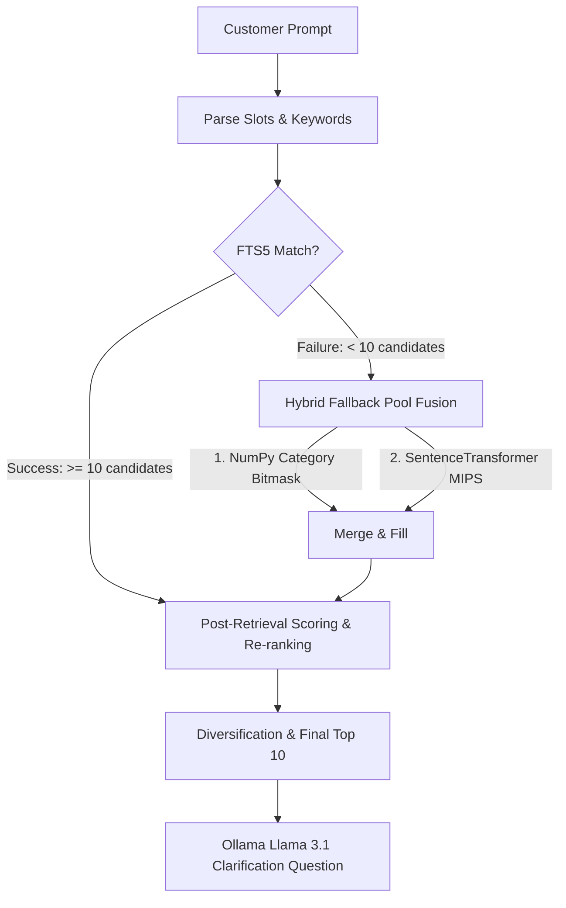

# Experiment 1 Sandbox: Shopping Copilot

Welcome to the **Experiment 1** sandbox. This directory contains the development and evaluation workspace for building and testing an intelligent e-commerce shopping copilot agent. 

---

## 1. Directory Overview

This experiment directory is organized as follows:
*   [agent.py](agent.py): The main hybrid agent implementation under development.
*   [agent_doc.md](agent_doc.md): High-level system design documentation for the agent.
*   [run_eval.py](run_eval.py): Local evaluation pipeline that runs the agent over the 200 public development sessions.
*   [shop_agent1.py](shop_agent1.py), [shop_agent2.py](shop_agent2.py), [shop_agent3.py](shop_agent3.py): Baseline experimental agents (lexical search, NumPy category routing, and dense vector MIPS).
*   [shopper_agent.py](shopper_agent.py): A conversational simulator that uses local LLMs (via Ollama) to stress-test the agent.
*   [interactive_shopper.py](interactive_shopper.py): Terminal UI to manually interact and test the agent.
*   [sessions/](sessions/): Auto-generated folder containing evaluation results and [failed_sessions.txt](sessions/failed_sessions.txt).
*   [visualizer/](visualizer/): HTML-based visualization dashboard and backend server to view session transcripts.

---

## 2. Agent Architecture

The agent is designed as a **Unified Hybrid Agent** combining keyword matches, database filters, and semantic search:



### Retrieval & Ranking Layers:
1.  **Keyword Route (SQLite FTS5)**: Indexes the catalog fields with column-specific BM25 weights. It attempts a strict `AND` query, falling back to a weighted `OR` query if matches are sparse.
2.  **Category Route (NumPy Bitmask)**: Filters the catalog on department, price, and category tokens using fast boolean arrays.
3.  **Vector Route (Dense Search)**: Computes dot-product (cosine similarity) between normalized query and product embeddings generated from a fine-tuned `SentenceTransformer` model.
4.  **Re-Ranking & Heuristics**: Applies penalties for retrieval order index, brand hard-filters, and boosts for active/stashed keywords. It then Jaccard-filters matching titles to diversify choices.

---

## 3. Running Evaluations & Tests

Before executing commands, activate the workspace virtual environment:
```bash
source ../.venv/bin/activate
```

### A. Run Local Evaluator
Evaluate the agent's overall metrics (`HitRate@10`, `MRR`, `MTTC`, `TechnicalScore`) on the 200 public sessions:
```bash
# Set FAST_EVAL=1 to bypass Ollama LLM prompt generation latency during debugging
FAST_EVAL=1 python run_eval.py
```

### B. Run Interactive Sandbox
Manually test the agent in real-time in the terminal:
```bash
python interactive_shopper.py --scenario buying
```

### C. Run Local Stress Test
Use a local Ollama model to act as a simulated user chatting with the agent:
```bash
python shopper_agent.py --scenario intent_override --model llama3.1
```

---

## 4. Troubleshooting & Known Bugs

Detailed comparison of [agent.py](agent.py) with [agent_doc.md](agent_doc.md) reveals several critical bugs that negatively impact performance:

### Bug 1: Missing Intent Override State Machine Logic (0% success in override tests)
*   **Symptom**: When a user changes their mind on Turn 3 or 4 (e.g., *"Actually, ignore my earlier preference. What I need is: leather."*), the agent fails to find the product because it continues matching the old, rejected keywords.
*   **Cause**: `stashed_terms` is initialized in `reset()`, but is never updated or used in `_parse_message_locally` or in scoring. The old preferences are never erased when override is triggered, leading to FTS5 search pollution.
*   **Fix**: Port the override parsing and term-stashing logic from [shop_agent1.py](shop_agent1.py#L202-L212):
    - Detect `What I need is: <new_value>.`
    - Erase the active slot memory of that attribute, stashing the old words into `stashed_terms`.
    - In re-ranking, apply a small decay boost (`+0.05`) to stashed terms while boosting active terms by `+0.3`.

### Bug 2: Missing Boundary Case Memory Deletion
*   **Symptom**: In `boundary` scenarios (5% of sessions), the customer has no preferences for a requested attribute and replies: *"I don't have a preference for [attribute]; please use your judgment."*
*   **Cause**: The agent never handles this message. It keeps asking for the same attribute and does not delete incorrect/default slots, causing the search pool to remain polluted.
*   **Fix**: Port boundary matching from [shop_agent1.py](shop_agent1.py#L194-L200) to erase the attribute from memory and track it in `asked_attributes` to avoid asking again.

### Bug 3: Singular vs. Plural Category Filtering Failure in Fallback Route
*   **Symptom**: In the category fallback track, when the user looks for a `"boot"`, the agent sets `state["category"] = "a boot"`. Category bitmask checks:
    ```python
    cat_tokens = set(target_cat.split())  # {"a", "boot"}
    cat_tok_mask = [bool(cat_tokens & item_cats) for item_cats in self.catalog_categories_set]
    ```
    Since the catalog category is `"Boots"` (plural), the intersection `{"a", "boot"} & {"boots"}` is empty, making the category mask evaluate to all `False`.
*   **Cause**: The fallback route uses exact category token matching instead of substring matching or basic plural normalization (stemming).
*   **Fix**: Normalize category tokens (e.g. stripping plural `s`) or switch to a fallback check that does a partial/fuzzy match when intersection fails.
