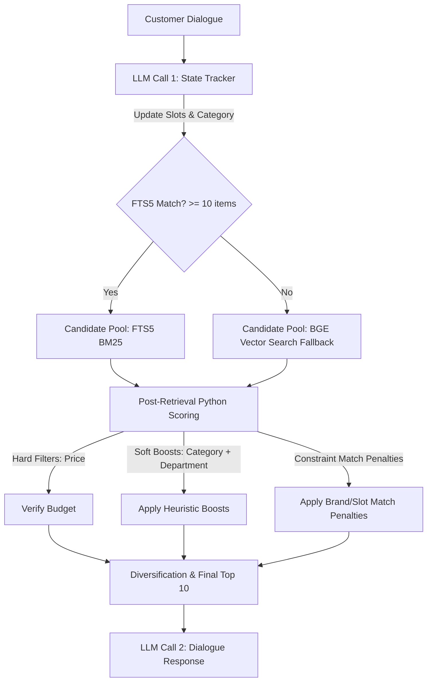

# Experiment 1 Sandbox: Shopping Copilot

Welcome to the **Experiment 1** sandbox. This directory contains the implementation, training pipeline, and evaluation suite for our custom **Unified Hybrid E-Commerce Copilot**.

---

## 1. Directory Overview

This experiment directory is organized as follows:
*   **`shop_agent.py`**: The main hybrid agent class. Implements FTS5 keyword indexing, dense vector search fallback, slot accumulation, and LLM-based state tracking and response generation.
*   **`shopper_agent.py`**: Conversational user simulator. Implements a cascading API router (DeepSeek-Chat $\rightarrow$ OpenAI $\rightarrow$ Gemini $\rightarrow$ Ollama local fallback) with custom prompts to mimic real-world customer tone and constraints.
*   **`run_eval_v2.py`**: Batch evaluation pipeline (Evaluator v2). Simulates dialogues between the `shopper_agent` and the `shop_agent` over a specified number of sessions.
*   **`finetune_embedder.py`**: Fine-tunes the BGE embedder model on automated query-positive-negative triplets extracted from the catalog and dataset.
*   **`run_eval.py`**: Deprecated Evaluator v1 pipeline (preserved for legacy comparison).
*   **`agent_doc.md`**: High-level design document detailing the agent's multi-step decision boundary.
*   **`eval_v1_results.json`**: Cached evaluation metrics from the Evaluator v1 baseline run.
*   **`eval_v2_results.json`**: Cached evaluation metrics from the Evaluator v2 baseline run.
*   **`model_finetuned/`**: Directory containing the local fine-tuned BGE model checkpoints, tokenizer configs, and weight safetensors.
*   **`eval_sessions/`**: Directory containing detailed dialogue transcripts (turn-by-turn shopper logs and agent recommendations) for all evaluated sessions.
*   **`sessions/`**: Legacy folder containing ID lists of successful and failed v1 sessions.
*   **`visualizer/`**: HTML visualizer tool and local backend server to inspect dialogue transcripts in a browser dashboard.

---

## 2. Agent Architecture

The agent is designed as a **Unified Hybrid Retrieval & Post-Scoring Pipeline**:



### Key Retrieval & Ranking Features:
1.  **SQLite FTS5 BM25**: Runs exact token queries against the database (excluding boolean variables like `"true"`/`"none"`).
2.  **Dense Retrieval (BGE-base-en-v1.5)**: Runs MIPS (Maximum Inner Product Search) over the 768-dimensional embeddings of the catalog if FTS5 matches are sparse ($< 10$ candidates).
3.  **State Slot Accumulation**: Dialogue state constraints accumulate over turns and only clear if the shopper pivots the product category (enforcing boundary case clearances and intent overrides in Python).
4.  **Universal Features**: Tracks the 7 universal e-commerce slots: `color`, `material`, `size`, `brand`, `use_case`, `style`, and `budget` (excluding category-specific slots like `"sole"` or `"height"`).

---

## 3. Running Evaluations & Tests

Activate your virtual environment before running scripts:
```bash
source ../.venv/bin/activate
```

### A. Train the Embedder Locally
Train the embedder model on your laptop:
```bash
python finetune_embedder.py
```

### B. Run Local Evaluator (20 Sessions)
Run a quick simulation test locally over 20 sessions:
```bash
# Clear old catalog caches to force re-encoding with new weights
rm -f catalog_cache_*
python run_eval_v2.py --samples 20 --model llama3.1
```

---

## 4. How to Run on the Compute Server (GPU)

To execute tasks on the compute server:

### A. Sync Local Code to the Server
Run this from your **local terminal** (laptop):
```bash
rsync -avz --exclude '.venv' --exclude 'catalog_cache_*' --exclude 'eval_sessions' --exclude 'results*.json' ./ techjam1@ubuntu-makers.tail007d64.ts.net:/scratch/techjam1/reptechjam2026/experiment_1/
```

### B. Running GPU Tasks on the Server
SSH into the server:
```bash
ssh techjam1@ubuntu-makers.tail007d64.ts.net
cd /scratch/techjam1/reptechjam2026
```

From here, you can execute training and evaluation tasks using Slurm scripts on the server, or run the scripts directly on interactive nodes using your server's GPU.
