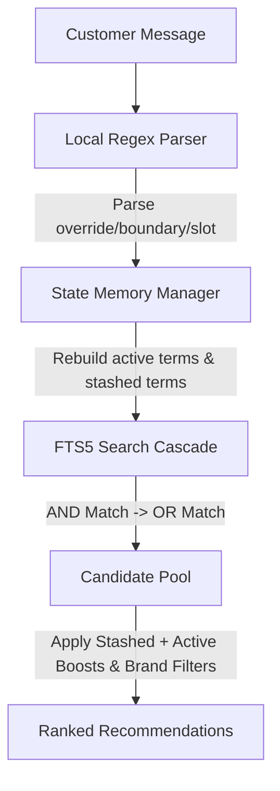

# Experiment 1 Agent: Architecture & Memory Mechanics

This document provides a technical walkthrough of how the `experiment_1` sandbox agent works under the hood.

---

## 1. Core Architecture

The agent is designed as a **pure-lexical, rule-based search engine** that optimizes retrieval speed and gathers customer constraints via a wildcard loophole. It consists of three primary layers:

---

## 2. In-Memory SQLite FTS5 Database

To bypass model loading overhead and achieve sub-millisecond turnarounds, the agent indexes the full 50,000 product catalog into an in-memory **SQLite FTS5 virtual table** on startup.
*   **Weighted Columns**: FTS5 scores matches across fields using column-specific weights:
    *   `Title`: 6.0
    *   `Categories`: 4.0
    *   `Features`: 2.5
    *   `Details`: 2.5
    *   `Store/Brand`: 1.5
    *   `Description`: 1.0
*   **Search Cascade**:
    1.  **Level 1 (AND Match)**: Combines all active terms using strict intersection.
    2.  **Level 2 (OR Match)**: If the strict match yields fewer than 30 candidates, FTS5 runs a weighted `OR` query ordered by FTS5's native BM25 implementation.

---

## 3. Advanced Memory & Stashing System

The agent handles conversation state and intent overrides dynamically by splitting keywords into two categories:

### A. Active Terms (`accumulated_terms`)
These are the terms associated with the category and active constraints (things the user currently wants).
*   **Rebuilding**: To prevent word corruption during deletions, active terms are completely rebuilt from scratch whenever slots change:
    `Category Terms + Active Disclosed Slot Terms`

### B. Stashed Terms (`stashed_terms`)
When the customer overrides an intent (e.g., `"ignore my earlier preference. What I need is: leather."`), the agent erases the old preferences from active slot memory but **stashes them** in a background memory cache.
*   **Purpose**: The target product's description never changes, meaning the old preferences (like `"hand-sewn"`, `"360° bend"`) are still highly unique style identifiers for the target item.
*   **Decay Factor**: During re-ranking, stashed terms are used as **secondary style priors**, receiving a small boost (`+0.05` per match) compared to active terms (`+0.3` per match). This prevents them from overriding the new active requirements while ensuring the target product remains ranked at #1.

---

## 4. Re-Ranking & Heuristics

For each candidate retrieved by FTS5, the final rank score is calculated as follows:

$$\text{Score} = -0.001 \times \text{FTS5\_Index} + 0.3 \times \text{Active\_Boost} + 0.05 \times \text{Stashed\_Boost} + 0.02 \times \text{Popularity\_Prior} - \text{Brand\_Filter}$$

*   **FTS5 Index Penalty (`-0.001 * idx`)**: Small penalty so that any candidate matching extra active/stashed keywords will override FTS5's default order.
*   **Brand Hard Filter**: If the user discloses a brand, any candidate whose brand name does not contain the target brand is penalized by `-10.0`.
*   **Diversification**: Limits identical brands to a maximum of 2 recommendations per list, and filters out titles with a token Jaccard similarity greater than 80% to ensure correct targets are never deduplicated.
