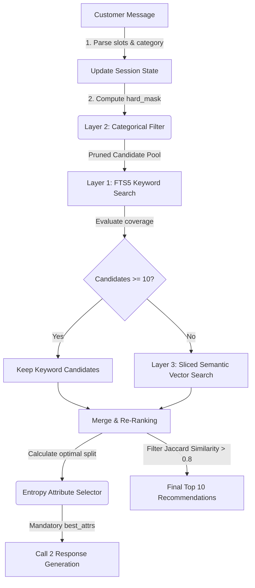

# Experiment 1 Agent: Architecture & Memory Mechanics

This document provides a technical walkthrough of how the `experiment_1` sandbox agent works under the hood.

---

## 1. Layer 1: Keyword Matching

The agent operates in a high-speed, deterministic **Simulator Mode (Agent 1)** when receiving templates generated by the evaluator. This layer bypasses the LLM entirely, running a pure-lexical database matcher to process requests:

### A. Template Verification & Routing
For every conversational turn, the normalized customer message is evaluated against signature simulator prefixes:
*   **Turn 1**: Starts with `"i'm looking for "`
*   **Later Turns**: Starts with `"for that, what matters is:"`, `"actually, ignore my earlier preference. what i need is:"`, `"i don't have a preference for"`, `"i don't have an additional preference for"`, or contains `"those options are not quite right yet"`.

If a message matches these rules, the agent remains in **Simulator Mode** and routes the message directly to the local `BaselineAgent` (Agent 1). If the message does not match, Simulator Mode is permanently disabled for the session, and it routes to the LLM agent.

### B. Local Regular Expression Parsing
Once routed, the `BaselineAgent` uses regex patterns to extract user intents, categories, and constraints:
*   **Category Resolution**: Extracted via `I'm looking for ([^.,]+)`. If a category shift is detected, the `seen_asins` cache is automatically cleared.
*   **Boundary Cases**: Extracted via `I don't have a preference for ([^;.]+); please use your judgment.`. It logs the slot under `asked_attributes` and clears any existing value for that attribute in memory.
*   **Intent Overrides**: Extracted via `What I need is: ([^.]+).`. It classifies the slot type, erases prior constraints for that slot, stashes the old constraints in memory, increments the search epoch, and resets the `seen_asins` cache.
*   **Preferences & Key Requirements**: Captured via `A key requirement is: ([^.]+).` and `what matters is: ([^.]+).` (multiple preferences are split on semicolons).

### C. Token Processing & Query Terms Rebuilding
After parsing the constraints, the search terms (`state["accumulated_terms"]`) are completely rebuilt from scratch by joining words from the category and all active constraint slots. A static list of stopwords is removed (e.g. `"looking"`, `"color"`, `"please"`, `"budget"`) to yield a clean list of search query terms.

### D. Search Cascade
Using the cleaned search terms, the agent queries its in-memory **SQLite FTS5 virtual table**:
1.  **FTS5 AND Search**: It first runs a strict query where all terms must match: `term1 AND term2 AND term3...`
2.  **FTS5 OR Fallback**: If the AND search returns fewer than 30 candidates, it runs an OR query: `term1 OR term2 OR term3...` ordered by SQLite's built-in **BM25 scoring function** with custom weights:
    *   `Title`: 6.0 | `Categories`: 4.0 | `Features`: 2.5 | `Details`: 2.5 | `Store/Brand`: 1.5 | `Description`: 1.0

### E. Post-Retrieval Python Scoring
The retrieved candidate list is re-scored in Python using a custom heuristic formula:
*   **Initial Score**: Set to `-0.001 * retrieval_index` (to preserve the initial FTS5 BM25 relevance ordering).
*   **Brand Hard-Filter**: Subtracts `10.0` from the score if the product's brand doesn't match the customer's specified brand constraints.
*   **Constraint Matching**: Adds `0.3` for every active search term found in the product's searchable text (title + categories + features).
*   **Rating Boost**: Adds `0.02 * (rating_number ** 0.1)` to favor highly rated items.

### F. Re-Ranking & Diversification
Candidates are sorted in descending order of their final score. To build the final top-10 recommendation list, the agent applies a title diversity filter:
*   **Title Diversity (Jaccard Similarity)**: It computes a Jaccard token overlap between the product title and already-selected titles. If the similarity is **$> 0.8$**, the product is skipped to avoid recommending duplicate/variant listings.

### G. Output Generation
Finally, the top 10 ASINs are packaged into the output dictionary with a fixed simulated dialog response `"Here are the top matches based on your preferences."` and `ask_attribute` set to `"other"`.

---

## 2. Layer 2: Categorical Filtering

The **Categorical Matching Layer (Agent 2)** enforces strict hard constraints on catalog products before retrieval and re-ranking, completely pruning out-of-scope candidates from the search space.

### A. Pre-compiled In-Memory Arrays
To ensure sub-millisecond vectorized filtering on catalog metadata, the agent loads the 50k items on startup into parallel NumPy arrays:
*   **`self.catalog_prices`**: Float array (defaults to `0.0` for missing values).
*   **`self.catalog_avg_ratings`**: Float array (defaults to `0.0` for missing ratings).
*   **`self.catalog_rating_numbers`**: Integer array of review counts (defaults to `0` for missing counts).
*   **`self.catalog_brands`**: Lowercase brand/store strings.
*   **`self.catalog_departments`**: Standardized canonical department tags.

---

### B. Standardized MECE Department Buckets
The raw `Department` column is processed on startup using a deterministic 4-stage pipeline that normalizes inconsistent casing, typos, and multi-gender labels into **11 Canonical, Mutually Exclusive, and Collectively Exhaustive (MECE)** categories:

| Canonical Department | target audience |
| --- | --- |
| `women` | Adult female clothing, shoes, and jewelry |
| `men` | Adult male clothing, shoes, and jewelry |
| `unspecified` | Missing raw tags or generic items (safe fallback) |
| `unisex-adult` | Gender-neutral adult items |
| `girls` | Youth female specific items |
| `boys` | Youth male specific items |
| `unisex-kids` | Gender-neutral youth/kids items |
| `baby-girls` | Infant/toddler female items |
| `baby-boys` | Infant/toddler male items |
| `baby` | Gender-neutral infant/toddler items |
| `multi-demographic` | Multi-gender listings (e.g. `men, women`) |

---

### C. Vectorized Hard Masking & Matrix Slicing
In `_respond_custom`, a unified boolean mask (`hard_mask`) is computed using fast NumPy element-wise functions:
1.  **Price limit**: `prices <= price_max` (allowing `0.0` missing values).
2.  **Average Star Rating**: `avg_ratings >= min_avg_rating` (allowing `0.0` missing ratings).
3.  **Rating Count**: `rating_numbers >= min_rating_number` (allowing `0` missing counts).
4.  **Brand/Store**: Checks for substring brand match.
5.  **Department Demographic Matching**: Translates the user's demographic preference (e.g. `"boys"`) into a set of allowed MECE buckets (e.g. `{"boys", "unisex-kids", "baby-boys", "baby", "unspecified", "multi-demographic"}`) and filters via `np.isin(self.catalog_departments, list(allowed_depts))`.

#### Slicing during Vector Fallback
If the FTS5 keyword candidate count falls below 10:
*   We locate the indices where `hard_mask` is `True` (`hard_indices = np.where(hard_mask)[0]`).
*   We slice the `self.catalog_embeddings` matrix to only contain these allowed indices: `self.catalog_embeddings[hard_indices]`.
*   We run semantic dot-product similarity *only* on this sliced matrix. This guarantees that gender and department mismatches are mathematically blocked from being recommended.

---

## Shannon Entropy Attribute Selector (Between Layer 2 and Layer 3)

The **Shannon Entropy Attribute Selector** acts as the conversational guide. Instead of using hardcoded heuristic sequences, it dynamically runs an information-theory-based optimization over the active candidate pool to determine which question will narrow down the search space most aggressively.

### A. Mathematical Framework

#### 1. Candidate Space Entropy
Calculates the uncertainty (in bits) remaining across the top $K$ active candidate products ($C$):
$$H(C) = -\sum_{i=1}^{|C|} \frac{1}{|C|} \log_2\left(\frac{1}{|C|}\right) = \log_2(|C|)$$

#### 2. Attribute Shannon Entropy & Value Distribution
Calculates the distribution spread for a candidate metadata attribute $A$ (e.g. brand, color) across its unique values $v \in V_A$:
$$P(v) = \frac{|C_v|}{|C|}$$
$$H(A) = -\sum_{v \in V_A} P(v) \log_2 P(v)$$

#### 3. Expected Conditional Entropy
Computes the remaining candidate pool uncertainty after the user provides an answer for attribute $A$:
$$H(C \mid A) = \sum_{v \in V_A} P(v) H(C_v) = \sum_{v \in V_A} \frac{|C_v|}{|C|} \log_2(|C_v|)$$

#### 4. Expected Information Gain (IG)
Measures the expected reduction in search space entropy achieved by asking about attribute $A$:
$$\text{Gain}(C, A) = H(C) - H(C \mid A)$$
*Mathematical Identity:* For a discrete partitions split, $\text{Gain}(C, A)$ is mathematically identical to the Attribute Shannon Entropy $H(A)$.

#### 5. Split Information & C4.5 Gain Ratio
Penalizes high-cardinality attributes (e.g., brand fields with dozens of unique names) that produce fragmented splits with low expected utility:
$$\text{SplitInfo}(A) = -\sum_{v \in V_A} \frac{|C_v|}{|C|} \log_2\left(\frac{|C_v|}{|C|}\right)$$
$$\text{GainRatio}(C, A) = \frac{\text{Gain}(C, A)}{\text{SplitInfo}(A)}$$

#### 6. Sparsity / Coverage-Adjusted Gain
Discounts the calculated gain ratio by the proportion of candidates that have a populated entry for attribute $A$:
$$\text{AdjustedGain}(C, A) = \text{GainRatio}(C, A) \times \left(\frac{|C_{\text{populated}}|}{|C|}\right)$$
This prevents the agent from asking about attributes that are missing in most candidates (e.g., missing price/ratings).

#### 7. Target Attribute Selection Rule
Selects the optimal top 2 features $A^*$ to inject into the LLM system prompt:
$$A^* = \arg\max_{A \in \text{Unasked}} \text{AdjustedGain}(C, A)$$

---

## 3. Layer 3: Semantic Vector Search

The **Semantic Vector Search Layer (Layer 3)** acts as a robust recovery mechanism when exact keyword matching fails. It uses dense vector representations to retrieve products that match the customer's intent conceptually, even if they use different vocabulary:

### A. Fine-Tuned BGE Embeddings
*   **Model:** A fine-tuned `BAAI/bge-base-en-v1.5` SentenceTransformer.
*   **Encoding Scheme:** Catalog items are pre-encoded into 768-dimensional normalized vectors. The encoding prompt formats each product as:
    `Product: {title}. Categories: {categories}. Features: {features}.`
*   **Query Representation:** On user turns, the query string is prepended with BGE's search instruction prefix:
    `Represent this sentence for searching relevant passages: `

### B. MIPS Sliced Vector Retrieval
When the keyword route returns low coverage (<10 items), Layer 3 is triggered:
1.  **Retrieve Filtered Slices:** The agent gets the pre-computed `hard_indices` from Layer 2.
2.  **Cosine Similarity Dot-Product:** It multiplies the normalized query embedding with the sliced embedding matrix (`self.catalog_embeddings[hard_indices]`), calculating cosine similarity scores in parallel.
3.  **Indices Mapping:** It takes the top 150 matching indices from the slice, maps them back to their original catalog ASIN strings, and uses them as the candidate pool.

---

## 4. Unified Cascading Pipeline (How the Layers Work Together)

On every user turn, the three layers are executed in a sequential, cascading pipeline to ensure maximum retrieval accuracy and strict filter compliance:

### 1. Stage 1: State Ingestion & Hard Masking (Layer 2)
On receiving a message, the agent updates the session state (managing overrides, target category shifts, and slot boundaries). It immediately evaluates the active constraints against the catalog's NumPy arrays to produce a unified `hard_mask` boolean index, instantly narrowing down the 50,000 items to a compliant candidate subset.

### 2. Stage 2: Keyword Route Matching (Layer 1)
The active keyword list is queried against the in-memory SQLite FTS5 index (running an AND query, cascading to an OR BM25-ranked query if coverage is low). These matches are intersected with the Layer 2 `hard_mask`.

### 3. Stage 3: Semantic Fallback Slicing (Layer 3)
If Layer 1 yields fewer than 10 products, the pipeline activates Layer 3. The query is vector-encoded, and matrix multiplication is executed *only* against the active NumPy subset that passed the Layer 2 categorical filters.

### 4. Stage 4: Post-Scoring & Re-Ranking
The merged candidate pool is sorted using a scoring formula:
$$\text{Score} = -0.001 \times \text{Retrieval\_Index} + 0.3 \times \text{Active\_Keyword\_Boost} + 2.0 \times \text{Category\_Phrase\_Boost} + \text{Soft\_Boosts}$$
*   **Soft Boosts:** Adds `+20.0` for department matches, `+15.0` for category matches, and a popularity weight.
*   **Title Jaccard Filter:** Any product with a title similarity $> 0.8$ compared to already-selected items is discarded.
*   **Recommendation:** The top 10 items are returned to the user.

### 5. Stage 5: Dynamic Attribute Selection (Entropy Selector)
Simultaneously, the top candidate list is passed to the Shannon Entropy Selector. It calculates the expected conditional entropy, split information, and coverage-adjusted gain for each unasked attribute over the candidate set. The top 2 attributes are selected and injected into LLM Call 2, guaranteeing that the copilot's conversational response asks the customer the most optimal questions.

