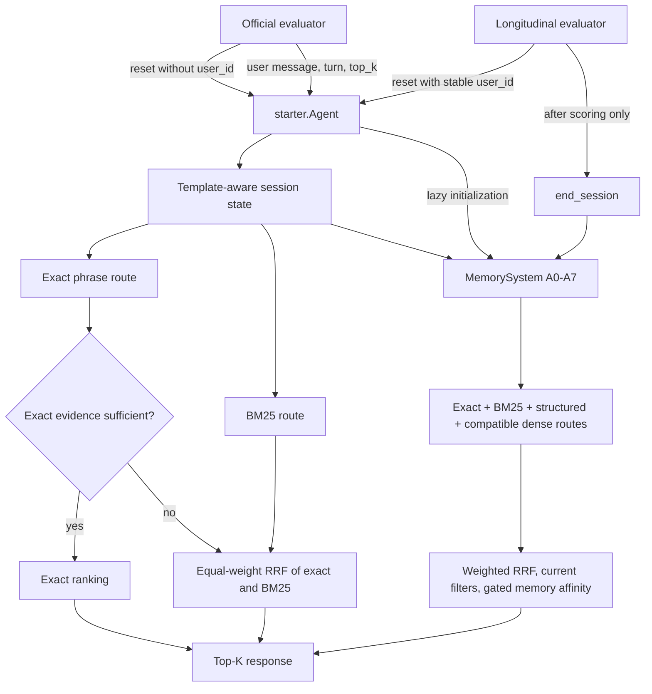

# TechJam 2026 codebase summary

Status snapshot: 2026-08-29

This document maps the whole workspace and distinguishes the live competition path from research candidates, generated artifacts, and organizer reference code. The companion document, [MEMORY_ARCHITECTURE.md](MEMORY_ARCHITECTURE.md), traces the longitudinal-memory implementation in detail.

## 1. Executive summary

The workspace implements and studies a conversational product-search agent for a frozen catalog of 50,000 Amazon Clothing, Shoes, and Jewelry products. A deterministic evaluator runs 200 public sessions, permits at most 10 turns, and scores exact `parent_asin` matches using Hit Rate@10, MRR, and mean turns to conversion.

There are four major code areas:

| Area | Purpose | Runtime status |
|---|---|---|
| `techjam-conversational-search/` | Active catalog, evaluator, live `starter.Agent`, memory package, visualizer, and WARP-style component | Live competition implementation |
| `nickolas/` | Reproducible research harness, eleven experiments, result artifacts, caches, and analysis | Research and evidence; not automatically deployed |
| `experiment_1/` | Separate hybrid-agent sandbox with FTS5, category masks, dense retrieval, Ollama helpers, and a browser visualizer | Alternative sandbox; not the official live agent |
| `techjam-conversational-search-participant-kit/` | Organizer reference kit, weak starter, evaluator copy, schemas, and tests | Read-only control/reference |

The current live agent is `techjam-conversational-search/starter/agent.py`. Its default anonymous-session behavior is the Experiment 7 exact-phrase/BM25-RRF policy. It now also has an optional longitudinal-memory path, activated only when `reset` receives an explicit stable `user_id`.

The official local evaluator currently calls `reset(session_id, user_profile)` without a user ID and never calls `end_session`. Therefore, its current 200-session evaluation exercises the unchanged anonymous baseline path and does not exercise longitudinal learning.

The highest public score observed anywhere in the research artifacts belongs to the Experiment 11 clean FTS5 candidate, but that candidate was not promoted because the public data had already been inspected. It is not the current live agent.

### Current worktree state

At this snapshot, the longitudinal integration exists in the working tree rather than a clean committed tree:

- `techjam-conversational-search/starter/agent.py` is a modified tracked file.
- `techjam-conversational-search/memory/` is an untracked subtree.
- These two summary documents are new untracked files.

This matters operationally: committing only `starter/agent.py` without adding `memory/` would leave anonymous evaluation working because the import is lazy, but any explicit memory-enabled reset would fail to import the package. The Agent change and complete memory package must be versioned and deployed together.

## 2. Challenge and API contract

### Dataset

- Catalog: `techjam-conversational-search/data/catalog.jsonl`
- Catalog size: 50,000 products
- Public set: `techjam-conversational-search/data/public_set.jsonl`
- Public sessions: 200
- Public scenarios: 80 buying, 80 browsing, 30 intent override, and 10 boundary
- Organizer private set described in the challenge: 800 additional sessions
- Product identifier: `parent_asin`
- Public profiles: 125 distinct profile payloads across 200 rows; these are not stable user identities

The catalog is frozen and treated as read-only. Product fields used across the codebase include `title`, `categories`, `features`, `details`, `description`, `store`, `price`, and `rating_number`.

### Required agent methods

The official interface is:

```python
agent = Agent(catalog_path)
agent.reset(session_id, user_profile)
response = agent.respond(session_id, user_message, turn, top_k=10)
```

The response shape is:

```python
{
    "message": str,
    "ask_attribute": str | None,
    "recommendations": [{"parent_asin": str}, ...],
    "usage": {
        "prompt_tokens": int,
        "completion_tokens": int,
    },
}
```

`ask_attribute` may be `category`, `material`, `color`, `size`, `style`, `brand`, `budget`, `feature`, `use_case`, `other`, or `None`.

The live agent extends this interface backward-compatibly with keyword-only longitudinal arguments and a completion callback:

```python
agent = Agent(catalog_path, memory_preset="A7")
agent.reset(
    session_id,
    user_profile,
    user_id="stable-user-17",
    sequence_index=3,
)
response = agent.respond(session_id, user_message, turn, top_k=10)

# Only after scoring/outcome observation:
agent.end_session(
    session_id,
    {"status": "completed", "purchased": True},
    purchased_product=product_id,
)
```

### Evaluation

The evaluator runs at most 10 turns. A target appearing before the required intent-override boundary does not count. A miss is assigned turn 11.

```text
Efficiency     = clip((11 - MTTC) / 10, 0, 1)
TechnicalScore = 0.50 * HitRate@10
               + 0.30 * MRR
               + 0.20 * Efficiency
```

The checked-in current-agent result is:

| Metric | Value |
|---|---:|
| Sessions | 200 |
| Hit Rate@10 | 0.955 |
| MRR | 0.651821 |
| MTTC | 2.61 |
| Efficiency | 0.839 |
| TechnicalScore | 0.840846 |

## 3. Live system architecture



The two paths deliberately coexist:

- Anonymous sessions use the legacy exact/BM25 system without constructing memory.
- Explicitly identified sessions use the memory controller, which calls the existing exact and BM25 rankers through adapters.
- Preset A0 passes the existing final ranker through unchanged and retains no history.

## 4. Active project: `techjam-conversational-search/`

### `starter/agent.py`: live agent

Initialization performs the following work:

1. Loads the catalog once into ordered `ids` and `products` lists.
2. Builds an ID-to-row map.
3. When NumPy, SciPy, and scikit-learn are available, builds a `CountVectorizer` count matrix and a BM25-weighted sparse matrix.
4. Otherwise builds an in-memory SQLite FTS5 fallback.
5. Leaves the longitudinal `MemorySystem` uninitialized until a real `user_id` is supplied.

#### Legacy session parser

The baseline parser recognizes the deterministic evaluator templates:

- Initial exploration: `I'm looking for CATEGORY, but I'm still exploring.`
- Initial requirement: `I'm looking for CATEGORY. A key requirement is: VALUE.`
- Later disclosure: `For that, what matters is: VALUE; VALUE.`
- Same-topic replacement: `Actually, ignore my earlier preference. What I need is: VALUE.`

It stores category, ordered deduplicated constraint strings, an optional override seed, raw message history, and the profile payload. The profile is retained but does not affect baseline ranking.

#### Exact route

For every category/constraint phrase, the agent calculates:

- a binary exact-substring match over normalized product text;
- token-overlap coverage using the count matrix.

The score is dominated by exact phrase count:

```text
exact_score = 1000 * exact_phrase_count + summed_token_overlap
```

Results are sorted by descending score and then ascending ASIN.

#### BM25 route and conditional cascade

BM25 uses the concatenated category and active constraints. The agent invokes the BM25 fallback when:

- there are no constraints;
- no product contains all phrases exactly; or
- the highest exact tier contains more products than `top_k`.

When fallback is required, exact and BM25 rankings are fused with equal-weight reciprocal rank fusion using `RRF_K=60` and depth 1,000. Otherwise, the exact ranking is used directly.

The SQLite fallback queries unique non-stopword terms with weighted FTS5 BM25 fields: title 6.0, categories 4.0, features/details 2.5, store 1.5, and description 1.0.

#### Response policy

The live agent always asks for `other`. It reports zero model tokens because no LLM is called. The natural-language message depends only on whether any constraints are active.

#### Longitudinal extension

With an explicit `user_id`, `respond` first updates the ordinary starter state and then the typed memory state. `MemorySystem.rank_catalog` receives existing exact/BM25 callbacks and returns the final ASINs. `end_session` is the only persistent-memory commit point. See the companion memory document for the complete flow.

### `memory/`: query-aware longitudinal subsystem

The memory package is a per-Agent, in-process subsystem. Its primary modules are:

| Module | Responsibility |
|---|---|
| `types.py` | Typed constraints, sessions, outcomes, episodes, profiles, contexts, plans, and debug records |
| `store.py` | User partitioning, chronology, begin-time visibility snapshots, commit/discard, and profiles |
| `session_state.py` | Template and free-form parsing, typed slots, negatives, and topic shifts |
| `embeddings.py` | MiniLM provider, lexical fallback, cache validation, and dense catalog index |
| `episodic.py` | Query-conditioned historical episode scoring and top-three selection |
| `profiles.py` | Fast/slow vector and evidence aggregation with exponential session decay |
| `gating.py` | Interpretable relevance gate controlling memory influence |
| `routing.py` | Buying/browsing route interpolation and memory-conditioned route planning |
| `scoring.py` | Structured catalog route, hard filters, and memory affinity |
| `fusion.py` | Weighted RRF and final memory-adjustment accounting |
| `integration.py` | Public lifecycle and retrieval orchestration through `MemorySystem` |
| `config.py` | Default constants and A0-A7 ablation presets |
| `metrics.py` | Rank uplift and memory-harm helpers |
| `tests/` | 38 lifecycle, isolation, parsing, retrieval, embedding, ablation, and compliance tests |

`memory/AUDIT.md` and `memory/SCOPE.md` describe the subsystem before it was integrated. Their statements that `starter/agent.py` has no memory hooks are now historical and no longer describe the current worktree.

### `evaluator/local_evaluator.py`: deterministic simulator

The evaluator:

1. Loads the public JSONL and catalog metadata.
2. Constructs one Agent for all 200 samples.
3. Creates a random session ID for each row.
4. Calls `reset(session_id, user_profile)` with no stable user ID.
5. Reconstructs hidden intent cards from target metadata when necessary.
6. Emits deterministic initial and follow-up messages.
7. Normalizes recommendations to valid, unique catalog ASINs.
8. Stops on an eligible target hit or after turn 10.
9. Computes aggregate and per-scenario metrics.

The target and hidden intent card remain in the evaluator and are never supplied to the agent. The evaluator currently has no post-scoring `end_session` call, so longitudinal memory is intentionally dormant.

### `data/` and `docs/`

`data/` contains the frozen catalog, public sessions, and attribution/readme material. `docs/` contains the JSON Agent schema, evaluation constants, baseline metrics, competition specification, and submission rules.

### `visualizer/`

`trace_agents.py` dynamically loads the organizer baseline and current agent, replays public sessions, and writes detailed side-by-side traces. The HTML dashboard displays aggregate deltas, every turn, target ranks, recommendations, product previews, and errors. These traces contain evaluator-only truth and are testing artifacts, not agent inputs.

### `harshith/`

`WARPRetriever` is a reusable weighted lexical retriever, not part of the live Agent. It builds or loads a pickled inverted index, applies BM25-style field-weighted retrieval, takes a 250-product pool, and reranks using term coverage, rare matches, phrase coverage, and base rank. It returns evaluator-compatible ASIN dictionaries. The intended integration boundary leaves conversation state and memory in the Agent.

### `current_agent_results.json`

This is the deterministic 200-session output for the live anonymous agent. The longitudinal integration was verified to reproduce it byte for byte because the evaluator supplies no user identity.

## 5. Nickolas research system

### Research harness

`nickolas/experiments/harness.py` is the shared experimental foundation. It:

- loads the official evaluator without modifying it;
- validates catalog/public-set inputs;
- reconstructs observable per-turn traces;
- builds cached lexical BM25 and exact-match indexes;
- lazily builds or loads MiniLM dense embeddings;
- provides exact, BM25, dense, and hybrid rank helpers;
- replays policies and computes ranking metrics;
- writes stable JSON/CSV artifacts, source hashes, package versions, logs, and manifests.

The research constants live in `config.py`: seed `20260826`, MiniLM `all-MiniLM-L6-v2`, maximum sequence length 128, top-K 10, and RRF `k=60`, depth 1,000.

`run_all.py` verifies the untouched participant baseline, constructs the harness, runs selected experiments, preserves failure artifacts, and regenerates result indexes and the combined summary.

### Eleven experiments

| Experiment | Purpose | Main recorded result |
|---|---|---|
| 1. Constraint uniqueness | Oracle analysis of how exact constraints narrow the catalog | Four constraints leave a median of one exact candidate; 63.5% uniqueness |
| 2. Target-rank curves | Compare agent-realistic retrieval methods across turns | Exact phrase led early study with score 0.816917 |
| 3. Field signal | Measure which catalog fields contain target constraints | Features had 93.9% exact coverage |
| 4. Constraint classification | Audit attribute-classifier coverage and precedence | `other` can expose all 800 generated constraints |
| 5. Candidate shrinkage | Measure exact and soft candidate-set contraction | Median exact set reaches one at four constraints |
| 6. Slate widths | Compare fixed Top-K against adaptive-width policies | Held-out Top-10 beat the adaptive policy |
| 7. Residual failures | Calibrate exact-first conditional BM25-RRF | Selected and promoted the live `exact_stateful_bm25_rrf` policy |
| 8. Intent-routed dense browsing | Route browsing to MiniLM dense retrieval | Routing detection worked, but held-out score regressed |
| 9. Adaptive hybrid | Test typed state, route mixtures, and clarification policies | Calibration selected an identity/control variant; no promotion |
| 10. XTR/WARP | Compare imported late-interaction/WARP rankings with Experiment 7 | WARP narrowly beat BM25 on the recorded held-out split |
| 11. Clean FTS5 candidate | Audit a deterministic FTS5/pagination/popularity architecture | Best observed public score 0.899530; no clean production promotion |

Experiments 1, 3, 4, and 5 use hidden labels for offline diagnosis and must not be interpreted as deployable agent behavior. Experiments 2 and 6-11 are designed around observable turn information, although Experiment 11 is explicitly retrospective because the public set had been inspected.

### Experiment 11 candidate versus live agent

`experiment_11_candidate_agent.py` implements a separate `CleanFTSAgent` with:

- an in-memory FTS5 catalog;
- exact official-template parsing;
- AND retrieval followed by weighted OR expansion;
- term-coverage and weak popularity reranking;
- brand/title diversification;
- global, query-scoped, or disabled pagination;
- a deterministic specific-question cycle.

The best observed configuration was specific questions plus global pagination:

| Metric | Value |
|---|---:|
| Hit Rate@10 | 1.000000 |
| MRR | 0.717101 |
| MTTC | 1.780000 |
| TechnicalScore | 0.899530 |

The calibration-selected query-pagination variant scored 0.894362 overall. Neither variant replaced the live starter because the apparent advantage needs private or newly generated validation and may depend on public-target popularity skew and simulator-specific behavior.

### Results and caches

`nickolas/results/` contains generated metrics, per-session rows, comparisons, plots, logs, source snapshots, manifests, imported Experiment 10 artifacts, and human summaries. These are evidence and reproduction outputs, not runtime dependencies except for the optional cache directory.

`nickolas/results/cache/` contains:

- a 50,000 x 384 float32 MiniLM product matrix, approximately 76.8 MB;
- a cached lexical index, approximately 94.4 MB;
- a local snapshot of `sentence-transformers/all-MiniLM-L6-v2`.

The memory subsystem may discover and validate the dense matrix and local model from this directory. The dense cache is accepted only when catalog hash, cache hash, row count, dimensionality, dtype, finiteness, normalization, and embedding-space identity all match.

### Nickolas documentation and notebooks

| Path | Role |
|---|---|
| `CURRENT_BEST_ARCHITECTURE.md` | Detailed Experiment 11 research brief; its statements that memory is not integrated are now stale |
| `draft.md` | Working design/research notes |
| `problem_info.md` | Nickolas-local copy of challenge information |
| `scenarios_info.md` | Scenario behavior notes |
| `experiments/methodology.md` | Leakage boundaries, experimental methods, split discipline, and reproducibility rules |
| `colab/experiment_10_xtr_warp_colab.ipynb` | External-compute workflow for Experiment 10 indexing/retrieval |

### Tests and CLIs

The research suite contains 41 unit tests covering the harness, Experiments 7-11, parser identity, routing, rank fusion, promotion gates, WARP imports, clean FTS pagination, and configuration validation.

Experiment 7 and Experiment 10 include terminal viewers for summaries and example replays. The Colab notebook supports Experiment 10 WARP/XTR work on external compute.

## 6. `experiment_1/` sandbox

This directory is an independent development branch and should not be confused with the live starter.

### Main sandbox agent

`experiment_1/agent.py` combines:

1. SQLite FTS5 keyword retrieval.
2. NumPy category, department, and price masks.
3. SentenceTransformer dense product/query embeddings.
4. AND then OR lexical fallback.
5. Dense fallback when fewer than 10 lexical candidates remain.
6. Active/stashed keyword and popularity heuristics.
7. Brand and title diversification.
8. Optional Ollama Llama 3.1 response generation, with `FAST_EVAL=1` bypass.

It has session-local state but is not connected to the longitudinal `MemorySystem`. Its `stashed_terms` mechanism is a sandbox-specific override heuristic, not cross-session user memory.

### Other sandbox components

| File | Role |
|---|---|
| `shop_agent1.py` | Lexical FTS5/state variant |
| `shop_agent2.py` | Category/price NumPy routing variant |
| `shop_agent3.py` | Dense SentenceTransformer variant |
| `run_eval.py` | Custom 200-session evaluator and text-log writer; imports unqualified local `agent` |
| `interactive_shopper.py` | Terminal interaction flow |
| `shopper_agent.py` | Ollama-driven stress-test shopper |
| `llm_user_simulator.py` | LLM-based user simulation helper |
| `visualizer/server.py` | HTTP/SSE evaluation server |
| `visualizer/export_sessions.py` | Converts session text logs into browser data |
| `visualizer/index.html` | Sandbox trace UI |

Some sandbox documentation is stale. In particular, `agent_doc.md` describes a pure lexical design while the current `agent.py` also builds category and dense indexes.

## 7. Participant kit

`techjam-conversational-search-participant-kit/` is the organizer reference/control tree. It contains:

- the weak starter agent;
- a copy of the deterministic evaluator;
- the public set and data documentation;
- schemas and competition rules;
- three evaluator unit tests.

The large catalog is expected to be supplied separately. The participant kit should remain unmodified so baseline reproduction and comparison remain trustworthy.

## 8. Root-level documentation and infrastructure

| File | Purpose |
|---|---|
| `README.md` | Workspace layout, API, metrics, and evaluator overview |
| `problem_statement.md` | Hackathon framing, scope, deliverables, and resources |
| `problem_info.md` | Expanded challenge information |
| `system_design.md` | Original five-workstream architecture proposal |
| `compute_server_guide.md` | Tailscale, SSH, Slurm, GPU/CPU, and file-transfer instructions |
| `SHA256SUMS` | Published data checksums |
| `.gitignore` | Generated caches, results, and local runtime exclusions |

`system_design.md` is a proposal rather than an exact description of the current implementation. For example, the live response policy is deterministic and has no LLM API, and memory is now an opt-in longitudinal subsystem rather than only session-local state.

## 9. Dependencies and runtime behavior

The live starter declares:

- NumPy
- SciPy
- scikit-learn

The research environment additionally declares:

- Matplotlib
- sentence-transformers
- PyTorch

SentenceTransformers is loaded lazily by memory. Anonymous live evaluation does not construct memory or load MiniLM. If scientific packages are unavailable, anonymous retrieval falls back to SQLite FTS5. If MiniLM or its compatible catalog cache is unavailable in an opted-in memory session, memory uses deterministic lexical embeddings for episodic behavior and omits incompatible dense catalog retrieval.

No external vector database, graph database, service, or process-global memory registry is used. The live agent reports zero token use and performs no network calls.

## 10. Verification status

The currently integrated agent and memory system were verified with:

```powershell
python -m unittest discover -s memory/tests -v
python -m unittest discover -s nickolas/experiments/tests -v
python -m unittest discover -s tests -v
python -m evaluator.local_evaluator --output <temporary-output>
```

Recorded results:

- Memory tests: 38 passed
- Nickolas experiment tests: 41 passed
- Participant-kit tests: 3 passed
- Official evaluator: 200 sessions, metrics identical to `current_agent_results.json`
- Evaluator output: byte-for-byte SHA-256 match after memory integration
- Real-catalog memory check: compatible MiniLM dense route available, same-user relevant history active, unrelated history down-gated, cross-user history isolated, negatives filtered, A0 equal to legacy, and a new Agent cold-started empty

## 11. Current source-of-truth rules

When files disagree, use this priority:

1. `techjam-conversational-search/starter/agent.py` for the live Agent.
2. `techjam-conversational-search/memory/*.py` for current memory behavior.
3. `techjam-conversational-search/evaluator/local_evaluator.py` for public evaluation behavior.
4. Tests for executable behavioral contracts.
5. `current_agent_results.json` for the current anonymous public result.
6. `nickolas/results/` and experiment source for historical research claims.
7. Older Markdown architecture/audit documents as design history, not necessarily current runtime truth.

## 12. Known architectural gaps

- The official evaluator has no stable user IDs, chronological per-user sessions, or post-scoring completion callback, so it cannot measure longitudinal memory.
- Memory is process-lifetime only; restarting or replacing the Agent loses all episodes and profiles.
- The live agent has two parsers: a simple starter parser and a richer typed memory parser. They intentionally share official-template behavior but free-form state may differ.
- The current dense memory blend uses whole-session/profile embeddings rather than per-attribute memory vectors or sparse attention over atomic facts.
- The live memory-enabled path is a four-route hybrid; it is not a category-filter-first, single-vector cosine search over all 50,000 products.
- The Experiment 11 public score is not unbiased private-validation evidence.
- Several historical documents still say the starter was unchanged or memory was standalone; those statements predate the current integration.
- The repository has multiple viable retrievers, but only the exact/BM25 adapters are used by the live Agent today.
- Completed session state and raw history are not purged from the Agent/MemorySystem dictionaries; only the committed episode is immutable and used as future longitudinal evidence.
