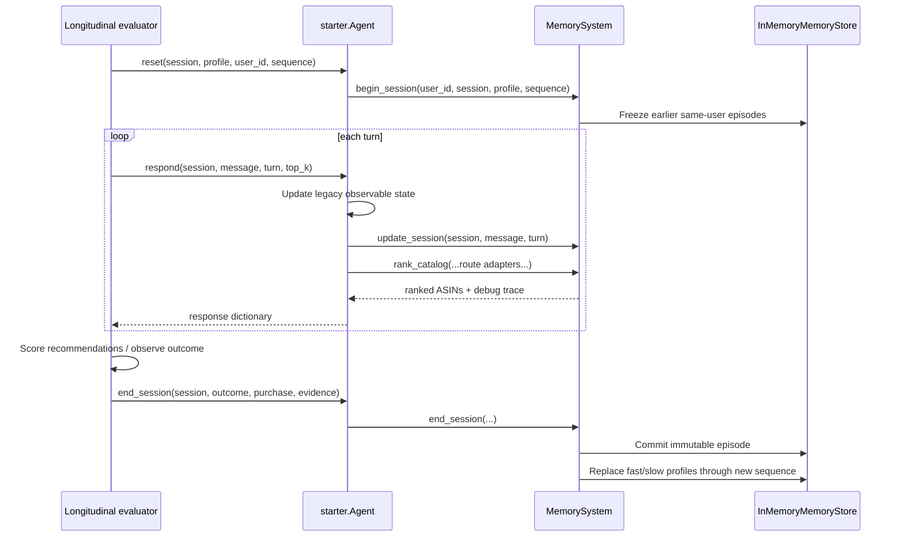
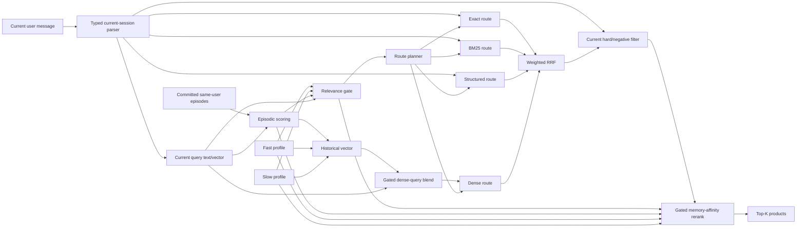

# Current longitudinal-memory architecture

Status snapshot: 2026-08-29

This document explains exactly how longitudinal memory is represented, updated, retrieved, gated, and applied by the current live Agent. For the surrounding repository, evaluator, experiments, and alternative agents, see [CODEBASE_SUMMARY.md](CODEBASE_SUMMARY.md).

## 1. The most important runtime fact

Memory is opt-in, not automatic.

The live Agent only enables memory when `reset` receives a non-empty explicit `user_id`:

```python
agent.reset(
    session_id,
    user_profile,
    user_id="stable-user-17",
    sequence_index=3,
)
```

If `user_id` is absent, the request takes the legacy exact/BM25 path. The `MemorySystem` is not even constructed. Calling `end_session` on such an anonymous session is a no-op.

The official evaluator currently calls only:

```python
agent.reset(session_id, sample["user_profile"])
agent.respond(session_id, user_message, turn, top_k)
```

It does not supply `user_id`, does not supply `sequence_index`, and does not call `end_session`. Consequently, current official/public evaluation contains no longitudinal memory updates or personalization.

## 2. Ownership and lifetime

Each `Agent` lazily creates at most one `MemorySystem`. That system:

- lives only for the lifetime of that Agent object/process;
- holds its own `InMemoryMemoryStore`;
- partitions history strictly by explicit `user_id`;
- shares the Agent's already-loaded catalog IDs and product dictionaries;
- does not use process-global or disk-persistent user memory;
- does not infer identity from session IDs, profile contents, sample IDs, or queries.

A new Agent starts with completely empty longitudinal memory, even for a previously used string such as `user_id="alice"`.

## 3. Lifecycle contract



### Begin session

`begin_session` validates that:

- `user_id` and `session_id` are non-empty;
- a session ID has never been reused;
- the same user does not already have an active uncommitted session;
- the requested sequence index is not earlier than the next legal index.

If `sequence_index` is omitted, the store assigns the next value for that user. Gaps are allowed. At begin time, the store freezes the exact tuple of committed episodes with a lower sequence index. Later commits cannot retroactively become visible to an already active session.

Different users may have overlapping active sessions. One user may not.

### Update turn

Every memory-enabled `respond` performs this order:

1. Append the message to the legacy Agent session.
2. Update the legacy category/constraint state.
3. Update the memory-local typed state.
4. Build a current query embedding and memory context.
5. Construct a retrieval plan.
6. Execute retrieval and record a debug trace.

No episode is committed during `respond`. The active session, target, recommendation results, and any future purchase remain unavailable as historical memory.

### End session

The evaluator or application must call `end_session` only after recommendations have been scored and the outcome is observable:

```python
agent.end_session(
    session_id,
    {
        "status": "completed",
        "reward": 1.0,
        "purchased": True,
    },
    purchased_product="B000...",
    evidence=[...],
)
```

This is the only operation that commits a `MemoryEpisode`. A repeated end call fails because the session is no longer active.

## 4. What is stored as vectors versus structured data

| Object | Vector representation | Structured representation |
|---|---|---|
| Active session | Temporary current-query embedding cached after ranking | User/session/sequence, profile, category, typed constraints, negatives, intent, confidence, history, override epoch |
| Committed episode | One normalized final-session embedding | Final query text, category, hard constraints, soft preferences, negatives, intent, specificity, confidence, outcome, purchase ID, evidence |
| Fast profile | Normalized recency-weighted centroid of compatible episode embeddings | Recency-weighted typed evidence, through-sequence index, episode count |
| Slow profile | Normalized longer-horizon centroid of compatible episode embeddings | Longer-horizon typed evidence, through-sequence index, episode count |
| Product catalog | Static normalized MiniLM matrix when the validated cache is available | Product fields, typed evidence matches, and numeric prices |
| Retrieval context | Current query vector plus compatible episode/profile vectors | Selected episodes, gate signals, masked attributes, cold-start flag |

The committed episode does not contain the complete raw transcript. It contains the distilled final query and typed state. However, the current implementation does not delete the original Agent session dictionary or `MemorySystem.states` entry after `end_session`, so the raw history remains reachable in process memory until the Agent is destroyed. It is not consulted as a committed historical episode.

### Typed constraints

Structured attributes are:

```text
category, budget, material, color, size,
style, brand, use_case, feature
```

Each `TypedConstraint` also records:

- hard versus soft;
- positive versus negated;
- explicit versus inferred;
- strength and confidence;
- source turn and source label;
- intent epoch.

`PreferenceEvidence` stores attribute, text value, polarity, strength, explicitness, source, source session, and sequence index.

## 5. Current-session parsing

`SessionStateParser` mirrors the three official starter templates and adds a deterministic free-form parser for longitudinal evaluation.

### Official templates

- Initial category/exploration
- Initial key requirement
- Semicolon-separated disclosure
- Same-topic replacement of the initial preference

### Additional free-form behavior

- Recognizes exploratory cues and assigns buying/browsing intent.
- Detects several abrupt topic-shift patterns.
- Detects explicit negatives such as `not black` or `avoid leather`.
- Detects hard requirement and soft-preference phrasings.
- Retains useful unmatched free-form statements as weaker inferred preferences.
- Ignores evaluator non-answer messages such as `I don't have...`.

On an abrupt category shift, the parser increments the intent epoch, sets `intent_override`, clears category-specific constraints and negatives, and retains only a sanitized numeric budget fragment if one exists. An explicit override forces the memory gate to zero for that turn.

## 6. Embeddings

### Primary space

The preferred embedding provider is:

```text
model: sentence-transformers/all-MiniLM-L6-v2
dimension: 384
maximum sequence length: 128
space ID: sentence-transformers/all-MiniLM-L6-v2:seq128:normalized
```

The provider and model are loaded lazily. The code searches ancestor directories for the local model snapshot under `nickolas/results/cache/models/`.

### Catalog cache validation

The static product matrix is accepted only if all of these match:

- catalog SHA-256;
- cache SHA-256;
- exactly 50,000 rows;
- exactly 384 columns;
- float32 dtype;
- finite values;
- normalized row norms;
- MiniLM embedding-space ID.

The checked-in working cache is approximately 76.8 MB and represents 50,000 x 384 float32 product vectors.

### Fallback

If the local MiniLM encoder cannot be loaded or fails, memory falls back to a deterministic signed lexical hash embedding. This preserves episodic memory semantics without network access.

The fallback has a different embedding-space ID. It is never compared with MiniLM episode/profile/catalog vectors merely because both have 384 dimensions. If the query and catalog spaces do not match, the dense catalog route is omitted and remaining route weights are renormalized.

### Episode embedding at commit

The episode's base vector is the final query embedding last observed during ranking. If no rank call cached one, `end_session` embeds the final query text.

When a purchased product is supplied after scoring, its product text may be embedded and weakly blended into the episode vector:

```text
episode_vector = normalize(
    (1 - cap) * final_query_vector
    + cap * purchased_product_vector
)
```

The default `purchase_evidence_cap` is 0.20 and the code hard-caps the vector blend at 0.25. A blend occurs only when shape and embedding-space ID match.

## 7. Immutable episodes and profiles

### Episode contents

Each committed `MemoryEpisode` contains:

```text
user_id
session_id
sequence_index
category
final_query
hard_constraints
soft_preferences
negatives
intent
specificity
confidence
embedding
embedding_space_id
preference evidence
outcome
purchased_product_id
```

Episodes are frozen dataclasses and are appended to immutable per-user tuples.

### Evidence generation

At commit:

- active positive constraints become positive evidence;
- explicit negatives become negative evidence with at least unit strength;
- externally supplied evidence is rebound to the committing session and sequence;
- a purchased product contributes weak inferred feature evidence based on its title.

No current purchase is inferred from recommendations. The caller must supply it after scoring.

### Fast and slow profiles

After each commit, profiles are recomputed from all same-user episodes in the latest compatible embedding space.

For episode age `a` and time constant `tau`:

```text
age_weight(a, tau) = exp(-a / tau)
```

Defaults:

- fast profile `tau = 1.5` sessions;
- slow profile `tau = 6.0` sessions.

The vector profile is a normalized weighted centroid. Structured evidence is grouped by `(attribute, normalized value, polarity)` and receives the same age decay plus a source multiplier. Explicit statements and rejections have full source weight, general inferred evidence has 0.60, profile seeds are weak, and purchase inference is capped.

## 8. Query-conditioned episodic retrieval

Only the frozen same-user episodes visible at begin time are candidates.

For each episode, the retriever calculates:

```text
total = 0.65 * semantic_similarity
      + 0.15 * structured_agreement
      + 0.10 * recency
      + 0.10 * evidence_strength
      - 0.35 * contradiction
```

Where:

- semantic similarity is non-negative cosine similarity in the same embedding space;
- structured agreement combines category match, exact typed-value overlap, and attribute-kind overlap;
- recency uses the slow session-decay constant when enabled;
- evidence strength favors explicit evidence;
- contradiction detects positive/negative conflicts and explicit same-attribute replacements.

An episode passes when either:

```text
semantic >= 0.12
```

or:

```text
structured >= 0.20
```

and its total score is positive. A7 retains at most the top three episodes, ordered deterministically by total score, recency, and session ID.

A2 and A3 intentionally retrieve recent history without query-conditioned rejection; A4 introduces query-conditioned selection.

## 9. Memory relevance gate

The central gate controls how much historical memory can influence the current request. It is always zero when:

- no historical episode passes;
- the session is a cold start;
- an explicit intent override is active; or
- the computed value is below the minimum gate of 0.05.

For passing episodes, the default A7 gate is:

```text
g = clip(
      0.30 * top_episode_score
    + 0.20 * mean_episode_score
    + 0.15 * fast_profile_similarity
    + 0.10 * slow_profile_similarity
    + 0.10 * history_support
    + 0.08 * intent_factor
    + 0.07 * specificity_factor
    - 0.40 * mean_contradiction,
    0,
    1
)
```

Vague/browsing queries receive a larger specificity factor than precise queries because memory is more useful when current evidence is sparse. This gate is recorded with all component signals in debug traces.

## 10. Masking current information against history

Explicit current attributes take precedence over history.

The context records every explicit attribute kind currently owned by the session. Historical structured evidence for those same kinds is removed from `masked_evidence`. Because a whole-session embedding entangles multiple properties, any explicit current attribute also disables the dense historical vector used for query blending and dense memory affinity.

This is conservative: it prevents stale history from overriding a current color, material, brand, or other explicit choice, but it also suppresses unrelated useful properties contained in the same historical vectors.

Current hard enforcement is separate from historical affinity:

- parsed budgets filter known prices above the ceiling;
- explicit brands require brand evidence;
- explicit negatives remove matching products.

The retrieval plan's `hard_filters` and `negative_filters` are observability fields. Actual enforcement is performed by `StructuredCatalogScorer.allowed_mask(state)` before memory reranking.

## 11. Retrieval planning

### Base buying and browsing weights

Default buying weights:

| Route | Weight |
|---|---:|
| Exact | 0.35 |
| BM25 | 0.30 |
| Structured | 0.25 |
| Dense | 0.10 |

Default browsing weights:

| Route | Weight |
|---|---:|
| Exact | 0.10 |
| BM25 | 0.20 |
| Structured | 0.25 |
| Dense | 0.45 |

Intent and specificity produce a `browse_factor`:

```text
browse_factor = 0.70 * is_browsing
              + 0.30 * specificity_factor
```

where specificity contributes 1.0 for vague, 0.5 for mixed, and 0.0 for precise. Route weights are linearly interpolated between buying and browsing policies.

### Memory-conditioned route shift

In A7, a positive gate shifts at most `0.20 * gate` total weight away from exact/BM25, preserving their relative proportions. Of the shifted mass:

- 45% goes to structured retrieval;
- 55% goes to dense retrieval.

Unavailable routes are removed and the remaining weights are normalized. Each active route defaults to depth 1,000.

### Current dense-memory vector operation

The current code does not apply softmax, sparsemax, or coordinate-level filtering.

It constructs one historical vector from:

- every passed episode vector weighted by its episodic relevance score;
- the fast profile vector with weight 0.65;
- the slow profile vector with weight 0.35.

It sums these vectors and normalizes the result:

```text
historical = normalize(
    sum(relevance_i * episode_i)
    + 0.65 * fast_profile
    + 0.35 * slow_profile
)
```

If no explicit current attribute masks history and a compatible dense route exists, it blends current query and history:

```text
blend = min(0.25, memory_query_blend_cap) * gate

dense_query = normalize(
    (1 - blend) * current_query
    + blend * historical
)
```

With default configuration, the maximum historical contribution is 25% and usually less because it is multiplied by the gate.

## 12. Four retrieval routes

### Exact

The Agent callback uses the memory parser's `(category, active constraints...)` phrases with the existing exact phrase scorer.

### BM25

The Agent callback uses the typed state's `query_text` with the existing sparse BM25 matrix. Memory does not build a second BM25 index.

### Structured

The structured scorer assigns product evidence using attribute-specific fields:

- category: categories/title;
- material/color/use case: title, features, details, description, and sometimes categories;
- size/style: selected descriptive fields;
- brand: store/title;
- feature: general product text;
- budget: numeric price comparison.

It combines current category and active constraint evidence, decays only inferred/soft turn evidence, subtracts explicit negative evidence, and excludes disallowed products.

### Dense

When query and catalog spaces match, the dense route performs inner-product ranking over the normalized 50,000-product catalog matrix. Inner product is cosine similarity for normalized vectors. It retrieves the top 1,000 before route fusion.

## 13. Fusion, filtering, and final memory affinity

The controller combines available route rankings with weighted reciprocal rank fusion:

```text
RRF(product) = sum_route(
    route_weight / (60 + route_rank)
)
```

Ties end with ascending ASIN. If a route fails or returns no candidates, its mass is removed and weights are renormalized.

After RRF:

1. `allowed_mask(state)` removes current budget, brand, and negative violations.
2. The remaining candidates receive historical memory affinity.
3. The gate scales the final memory adjustment.

Memory affinity combines compatible dense episode/profile similarities and unmasked structured historical evidence. The final score is:

```text
final_score = rrf_score
            + gate * 0.02 * memory_affinity
```

The default memory rerank weight is deliberately small (`0.02`). The top `top_k` products become recommendations.

## 14. Where memory enters the live architecture



Memory therefore affects three places:

1. Route weights: relevant history shifts mass toward structured/dense routes.
2. Dense query: a gated historical vector is blended into the current query.
3. Final ranking: gated historical affinity slightly adjusts fused candidate scores.

It does not alter anonymous baseline sessions.

## 15. A0-A7 ablation ladder

| Preset | Behavior |
|---|---|
| A0 | Existing final ranker pass-through; memory disabled; active session discarded at end |
| A1 | Hybrid exact/BM25/structured/compatible-dense retrieval; no persistent history |
| A2 | Naive recent episodic history and structured preference memory |
| A3 | Adds session-age decay |
| A4 | Adds query-conditioned episode selection |
| A5 | Adds relevance gating |
| A6 | Adds fast and slow profiles |
| A7 | Adds memory-conditioned route weights; current default |

Episodic, fast, slow, and structured-preference memory also have independent switches for controlled experiments.

In A0, the Agent passes its unchanged legacy final ranking as `baseline_route`. `end_session` discards the active memory record and retains no episode.

## 16. Debugging and observability

`Agent.get_debug_trace(session_id, turn=None)` delegates to the memory system for opted-in sessions. Anonymous sessions return `None`.

Each turn trace contains:

- user/session/sequence and turn;
- typed state summary;
- embedding-space ID;
- gate and every gate signal;
- retrieved episode IDs and component scores;
- planned and actually executed route weights;
- route depths and available routes;
- lexical query, memory blend, and browse factor;
- top component rankings;
- per-product RRF, affinity, adjustment, and final score;
- final ASIN ranking;
- whether the dense route executed.

The underlying `RetrievalPlan` also carries `hard_filters`, `negative_filters`, and `dense_query`; the debug serializer intentionally does not emit the full dense vector or those typed filter objects.

## 17. Isolation and leakage protections

The current implementation enforces:

- stable explicit user partitioning only;
- no identity inference from profiles or session IDs;
- begin-time frozen visibility;
- strictly monotonic per-user chronology;
- no same-user overlapping active session;
- no current-session episode before completion;
- no purchase/outcome input to `reset` or `respond`;
- explicit post-scoring commit only;
- embedding-space identity checks everywhere vectors are compared or blended;
- current explicit attributes overriding historical evidence;
- gate zero on cold start and intent override;
- deterministic ordering and tie-breaking.

The profile payload is ignored by memory by default. `seed_from_user_profile=True` can expose preference tags as weak structured evidence, but it cannot create history or a nonzero cold-start gate.

## 18. What the current memory does not do

The current system is not yet the category-filter-first, query-conditioned vector-memory design discussed separately. Specifically:

- It does not store one embedding per atomic preference or attribute; it stores one embedding per completed session plus two aggregate profile vectors.
- It does not use softmax/entmax over memory items.
- It does not remove irrelevant semantic dimensions from a vector.
- It either permits a whole historical vector or suppresses dense history when an explicit current attribute is present.
- It uses the blended vector only for the dense route, not as the sole retrieval query.
- It retrieves dense top-1,000 from the full catalog before applying the final current hard/negative mask.
- It still fuses exact, BM25, structured, and dense rankings.
- It applies a second small memory-affinity adjustment after RRF.
- It does not learn per-user route preferences or search style.
- It does not persist memory to disk or across Agent processes.
- It has no deletion, export, retention-window, or privacy-management API for production user data.
- It does not purge completed Agent/parser/session-state objects, even though only immutable episodes feed future memory retrieval.

These boundaries matter when evaluating a future design. Replacing `_memory_vector` with thresholded attention over atomic memory units and moving category/hard filtering before exact cosine retrieval would be an architectural change, not merely a configuration change.

## 19. How to activate memory in a future evaluator

A real longitudinal evaluator should construct one Agent for the full ordered run and, for each user session:

```python
agent.reset(
    session_id,
    user_profile,
    user_id=stable_user_id,
    sequence_index=chronological_index,
)

for turn in turns:
    response = agent.respond(session_id, user_message, turn, top_k=10)
    # Score recommendations outside the Agent.

agent.end_session(
    session_id,
    outcome,
    purchased_product=purchased_product_if_observed,
    evidence=optional_post_session_evidence,
)
```

Required properties:

- sessions must be ordered per user;
- stable IDs must represent real longitudinal identity;
- the target must never be passed before scoring;
- `end_session` must happen exactly once and only after the current session's result is fixed;
- a fresh evaluation run should construct a fresh Agent unless deliberate persistence is part of the protocol.

## 20. Verified behavior

The current integration has been tested for:

- cold start with gate zero;
- relevant same-user history with positive gate and nonzero memory adjustment;
- unrelated history with a materially lower gate;
- cross-user isolation;
- explicit negative filtering;
- intent override suppression;
- no visibility of active sessions or purchases before commit;
- A0 legacy-ranking identity and zero retained history;
- fresh-Agent isolation;
- valid response shape;
- dense-cache compatibility and space identity;
- dense-route omission and route renormalization on failure;
- deterministic repeated execution;
- duplicate/out-of-order lifecycle rejection.

In the real-catalog integration check, a related second session produced a gate of approximately `0.671`, an unrelated query produced a lower gate of approximately `0.258`, a different user remained at zero, and the validated MiniLM dense route executed. These numbers demonstrate behavior for that controlled scenario; they are not global quality metrics.
